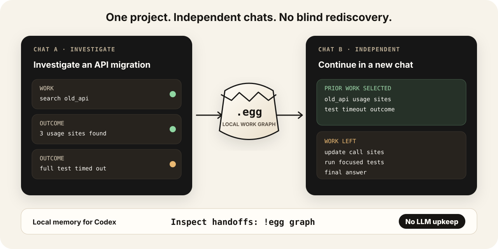

<p align="center">
  <picture>
    <source media="(prefers-color-scheme: dark)" srcset="docs/assets/brand/eggshell-primary-horizontal-white.svg">
    <source media="(prefers-color-scheme: light)" srcset="docs/assets/brand/eggshell-primary-horizontal.svg">
    
  </picture>
</p>

<p align="center">
  <strong>Stop paying twice for work Codex already did.</strong><br>
  Carry completed work across independent Codex chats—locally, without special prompts.
</p>

<p align="center">
  <a href="https://github.com/o8vm/eggshell/actions/workflows/ci.yml"></a>
  <a href="lean-toolchain"></a>
  <a href="LICENSE"></a>
</p>

<p align="center">
  <a href="#install">Install</a> ·
  <a href="#how-it-works">How it works</a> ·
  <a href="#evidence">Evidence</a> ·
  <a href="#control-and-inspection">Controls</a> ·
  <a href="#privacy">Privacy</a>
</p>

<p align="center">
  
</p>

Eggshell gives Codex a local memory that works across separate chats. When one
chat searches a repository, reads documentation, runs a command, or reaches a
useful conclusion, Eggshell records the work and its outcome. A later related
chat receives that prior work before acting, so it can continue instead of
starting from zero.

For example, one chat may find every use of an old API and discover that the
full test suite times out. A separate chat can receive both results, update the
call sites, and choose a more focused test instead of repeating the search and
the failed command. The chats do not share conversation history; they share only
a local `.egg` work graph.

Nothing special is required in the prompt. Eggshell observes normal Codex work,
keeps the data on your machine, and lets you inspect or discard every handoff.

In our LLVM follow-up benchmark, Eggshell used **about 80% fewer tokens than
starting fresh**, while keeping answers broadly usable: **9 of 10 needed no
substantive correction**. Eggshell builds and organizes memory locally,
**without LLM calls or additional billed tokens for memory management**.
See [Evidence](#evidence) for the measurements and quality review.

## Install

Requirements: standard Codex with Plugin hooks enabled, plus Python 3 for the
one-time local semantic-search setup.

```sh
curl --proto '=https' --tlsv1.2 -fsSL \
  https://raw.githubusercontent.com/o8vm/eggshell/main/install.sh | sh
cd your-project
egg init
```

The installer verifies the downloaded binary, installs the Codex Plugin and
`egg` command, and prepares a private local search runtime. `egg init` creates a
project config that declares the ignored `.eggs/work.egg` path. The authority
file itself is created only when the first kept turn is promoted. Review and
enable the installed hooks through Codex's `/hooks` screen.

The installation is relocatable. This keeps the executable, Plugin source,
MiniLM runtime/model, default state, and global config off a quota-limited home
directory:

```sh
export EGGSHELL_PREFIX=/scratch/$USER/eggshell
# Keep this export too when Codex itself uses a relocated home:
# export CODEX_HOME=/scratch/$USER/codex
curl --proto '=https' --tlsv1.2 -fsSL \
  https://raw.githubusercontent.com/o8vm/eggshell/main/install.sh | sh
export PATH="$EGGSHELL_PREFIX/bin:$PATH"
```

The default prefix is `~/.local`. Codex marketplace registration and its small
Plugin cache remain owned by Codex under its active `CODEX_HOME`; Eggshell does
not guess that location. Override `EGGSHELL_DATA_ROOT` with another absolute
path only when mutable Eggshell state should live outside the prefix too.

Then use Codex normally. After a response, Eggshell holds that turn temporarily;
it is saved when the next prompt starts unless you drop it. Eggshell does not
require a special prompt, JSON response, footer, or planning step.

If a connection ends a turn before the final response, Eggshell preserves every
terminal tool outcome it already observed and keeps the parent work open. A
reconnect does not require `!egg drop`; operations without a terminal result are
not invented or stored.

```text
!egg              show the active profile and staged turn
!egg on           enable Eggshell memory and graph transport
!egg off          disable storage and graph transport until `!egg on`
!egg graph         show exactly what Eggshell sent to Codex
!egg drop          discard the last staged turn
```

Run `egg init` once in each project that should keep its own work graph. See the
[Plugin guide](docs/codex-plugin.md) for shared work files, read-only profiles,
manual graph selection, recovery, and uninstall behavior.

## How it works

<p align="center">
  
</p>

1. Codex Plugin hooks record the prompt, supported tool operations whose terminal
   results Codex exposes, and the final answer. Empty outputs and reported
   timeouts or denials remain useful outcomes; Eggshell never invents a result
   for an operation with no terminal hook.
2. Before a related turn acts, Eggshell finds relevant work in the selected
   `.egg` files. It checks again when a proposed tool operation makes the current
   work more specific.
3. Eggshell sends a compact graph containing the earlier work, what happened,
   and an open instruction to finish everything that is still needed.
4. Codex decides what can be reused, what needs rechecking, and what remains to
   be done. Eggshell never treats a past answer as unquestionable truth.
5. The new turn is held before storage. You may keep it, redirect it to another
   work file, or drop it.

Eggshell is designed not to break Codex: if the Plugin is unavailable, the chat
continues normally, and an incomplete turn is not written to the work graph.

### Why this is more than retrieval

A normal retrieval system returns text that looks related to the new prompt.
Eggshell stores direction: **Work → Outcome**, plus how smaller pieces of work
belong to a larger turn.

Two graph operations make that history smaller and more useful:

- **Union** temporarily recognizes differently worded nodes as the same work for
  the current request. It does not rewrite the saved history.
- **Saturation** follows the newly connected Work → Outcome paths until no more
  relevant prior work can be reached.

The result is not a pile of similar passages. Codex receives the shortest
selected work graph plus an open remainder: the prior outcomes to use, and the
work that still has to be completed.

## What gets carried across chats

```text
Earlier chat
  searched the repository  → found three relevant files
  ran the full test suite   → timed out
  checked the migration doc → found the replacement API

Independent later chat
  receives those outcomes
  avoids blind repetition
  continues with the work that remains
```

| Capability | What you get |
| --- | --- |
| Normal Codex | Ordinary prompts and tools; no Eggshell-specific model output. |
| Memory across chats | Related independent chats can share one growing `.egg`. |
| Visible context | `!egg graph` shows the exact handoff sent to Codex. |
| Storage control | Profiles choose which work files may be read and where a new turn may be saved. |
| Review before save | Preview, keep, redirect, or drop a turn before it becomes shared memory. |
| Checked core rules | Lean checks that graph merging and selection preserve the recorded work and evidence. |

## Evidence

### Ten LLVM trials with the default handoff

We repeated one investigation of Clang target and language options that affect
toolchain selection or forwarded arguments. Each trial started in an independent
chat with the same question, source snapshot, model, and prior `.egg`. These
trials used the **current default handoff prompt**.
It directs the agent to reuse supported results, check unresolved or changed
facts, and report what was reused, checked, or left unverified.

Tokens are model input plus output; reasoning tokens are already included in
output. The figures below measure follow-up work using previously saved work.

| Measurement | Tokens per completed trial | Reduction vs. fresh reference |
| --- | ---: | ---: |
| Fresh reference: one run, no prior memory | 5,355,282 | — |
| Eggshell: arithmetic mean of 10 completed trials | **683,362** | **87.2%** |
| Eggshell: all 12 attempts, divided by 10 completions | **962,207** | **82.0%** |

The ten completed trials used 6,833,615 tokens in total, ranging from 140,781 to
1,803,931 per trial. Two additional attempts failed because a hook output was
missing; they consumed 2,788,458 tokens. Including those attempts gives a total
of **9,622,073 tokens** to obtain ten completed trials. Means are rounded to the
nearest token; percentages use the unrounded values.

**Quality:** a review of the answers against the fixed source and execution
records found six usable answers, three needing minor corrections, and one
needing a substantive correction to its cause and reproduction explanation.
Thus **9 of 10 needed no substantive correction**. This was a single-reviewer,
non-blinded assessment, not a 90% accuracy estimate. Clang Driver runtime tests
were unavailable, so the review assessed static evidence and reporting rather
than dynamically verified behavior.

This is one task repeated ten times, compared with a single fresh reference.
It does not establish a general reduction rate, quality equivalence to fresh,
or superiority over other memory methods.

<details>
<summary><strong>Workload, prior-work cost, and measurement record</strong></summary>

- Investigation: Clang toolchain selection and argument forwarding, answered in
  Japanese.
- LLVM source commit: `6dfe1677ab8dffbc6ec13d53a1e0215d75147689`.
- Model: `gpt-5.6-luna`, reasoning effort `xhigh`; trials ran serially.
- Prior work: the same 840,048-byte `.egg` from the preceding investigation, restored
  before each trial. It fixes the prior work, not the model's randomness.
- The preceding investigation used **6,552,155 tokens**, recorded separately and
  excluded from the follow-up figures above. The percentages describe reuse of
  existing work, not the cost of starting a new investigation from scratch.
- Per-trial counts, answer and receipt hashes, prompt text, and review outcomes
  are in the [measurement record](docs/benchmarks/llvm-follow-up.json).

</details>

## Control and inspection

Authority commands are shell commands, not model prompts, so they do not consume
a model turn.

```text
!egg                  show profile, read set, write target, and staged turn
!egg on               enable memory, staging, and graph transport
!egg off              disable them until `!egg on`; discard any staged turn
!egg use work         use the writable project profile
!egg next private     make the next turn read-only
!egg next off         disable Eggshell for the next turn
!egg keep             promote the staged turn
!egg drop             discard the staged turn

!egg graph             show the frozen handoff sent to this turn
!egg why               explain why it was selected
!egg diff              preview the staged graph change
!egg find TEXT         find a Value in selected authorities
!egg class VALUE       inspect its equivalence class
!egg next graph none   send no Eggshell context on the next turn
!egg next graph VALUE  send a graph slice chosen by the user
```

The same session relies on native history and does not echo its own stored turn
before compaction. Independent sessions can receive relevant work from `.egg`.
After compaction, graph that may have left native history becomes eligible for
restoration.

## Privacy

Eggshell has no hosted service, telemetry, analytics, or account system. Prompts,
tool results, embeddings, and `.egg` files remain local after installation. The
one-time setup downloads the release, pinned Python package, and MiniLM model.
Profiles can read without writing, and `!egg off` disables staging and graph
transport until `!egg on`; enabled turns are staged before storage.

See [PRIVACY.md](PRIVACY.md) for observed hook data, exact storage locations,
network behavior, and deletion. Report vulnerabilities through GitHub's private
channel described in [SECURITY.md](SECURITY.md).

<details>
<summary><strong>For implementers: the semantic core</strong></summary>

Natural language, code, tool output, patches, sources, and receipts are ordinary
Values:

```text
Value = Atom(bytes) | Apply(operator, references)
Ref   = Semantic(value) | Exact(value)
```

The operator vocabulary is closed:

```text
All · Outcome · Occurrence · Inquiry · Receipt
```

Roles come from relation position rather than permanent `Task`, `Result`,
`Message`, or `Evidence` types. Scoped equality and positive work relations
select prior work while preserving one open handoff.

Lean proves quotient equivalence and Exact preservation. Extract checks selected
`All`, completed `Outcome`, and advisory `Outcome` edges against the source graph
and active policy. A connection theorem proves that Matcher-driven completed
edges came from an existing Outcome and passed the forward reusable-work gate.
Executable tests cover Run-local Union, Demand saturation, concurrent promotion,
and Plugin lifecycle behavior.

</details>

## Development

Source builds use the toolchain pinned in [`lean-toolchain`](lean-toolchain).

```sh
lake build eggshell eggshell_tests
EGGSHELL_DATA_ROOT="$PWD/.lake/eggshell-tests-data" \
  .lake/build/bin/eggshell_tests
```

To install a source build:

```sh
lake build eggshell
EGGSHELL_PREFIX=/absolute/install/root \
  .lake/build/bin/eggshell install codex
egg init
```

See [CONTRIBUTING.md](CONTRIBUTING.md) before changing the persistent graph or
making performance claims. Brand assets are documented in
[docs/brand.md](docs/brand.md).

Eggshell is pre-release software. Persisted data created by an incompatible
development checkout may be rejected rather than silently reinterpreted.

## License

Licensed under [Apache-2.0](LICENSE).
