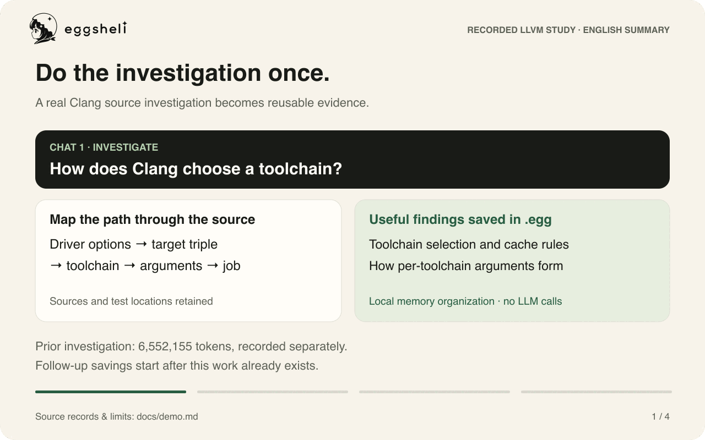
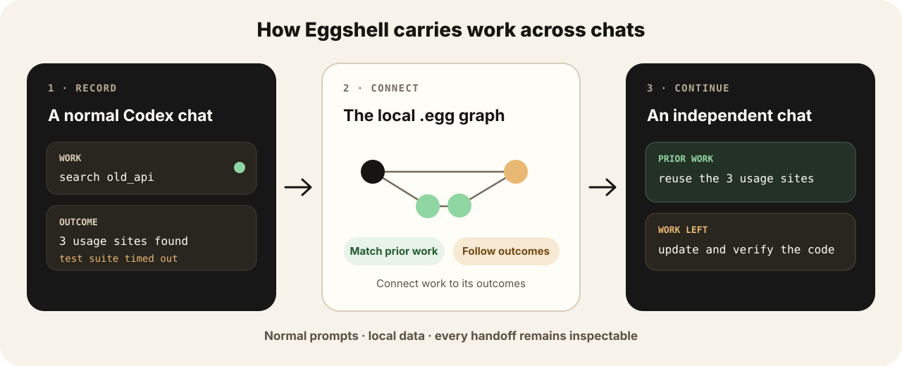

<p align="center">
  <picture>
    <source media="(prefers-color-scheme: dark)" srcset="docs/assets/brand/eggshell-primary-horizontal-white.svg">
    <source media="(prefers-color-scheme: light)" srcset="docs/assets/brand/eggshell-primary-horizontal.svg">
    
  </picture>
</p>

<p align="center">
  <strong>Stop paying twice for work Codex already did.</strong><br>
  Carry completed work across independent Codex chats—locally, without special prompts.
</p>

<p align="center">
  <a href="https://github.com/momonpya/eggshell/actions/workflows/ci.yml"></a>
  <a href="lean-toolchain"></a>
  <a href="LICENSE"></a>
</p>

<p align="center">
  <a href="https://chatgpt.com/plugins/plugins_6aa482a5d9048191a727260b5f898078">Get the plugin</a> ·
  <a href="#install">Install</a> ·
  <a href="docs/try-it.md">Try it yourself</a> ·
  <a href="docs/demo.md">30-second demo</a> ·
  <a href="#how-it-works">How it works</a> ·
  <a href="#evidence">Evidence</a> ·
  <a href="#control-and-inspection">Controls</a> ·
  <a href="#privacy">Privacy</a>
</p>

<p align="center">
  <a href="docs/demo.md">
    <picture>
      <source media="(prefers-reduced-motion: reduce)" srcset="docs/assets/demo/overview.svg">
      
    </picture>
  </a>
</p>

<p align="center">
  <a href="docs/demo.md">Read the recorded walkthrough</a> ·
  <a href="docs/assets/demo/walkthrough.mp4">Watch the 30-second video</a> ·
  <a href="docs/assets/demo/overview.svg">Static version</a>
</p>

Eggshell is a local memory plugin for Codex. It saves work from one chat and
makes relevant results available to a separate chat: repository searches,
commands, documentation findings, and the conclusions drawn from them.
It is useful when you return to related work in the same project.

In the [recorded LLVM walkthrough](docs/demo.md), one chat maps how Clang chooses
a toolchain. A new chat reuses those findings to investigate language and target
edge cases, and reports what remains unverified. You ask ordinary questions;
Eggshell selects prior work automatically. The walkthrough is an edited English
summary of the study, with links to its measurement record.

In our LLVM follow-up experiment, Eggshell used **about 80% fewer tokens than
starting fresh**, with **9 of 10 answers needing no substantive correction**.
Memory is built and organized locally, **without LLM calls or additional billed
tokens for memory management**. These results cover one task with existing
prior work; see [Evidence](#evidence) for the comparison and its limits.

## Install

You need macOS or Linux on Apple Silicon/ARM64 or x86-64, Python 3, and the Codex
CLI available as `codex`. Your Codex client must support plugins and command
hooks. Setup downloads the Eggshell binary and a local search model.

**[Install from the Plugins Directory](https://chatgpt.com/plugins/plugins_6aa482a5d9048191a727260b5f898078)**,
then ask Codex: **“Set up Eggshell for this Codex project.”** The included setup
workflow installs the runtime for the directory plugin.

For a standalone installation from a terminal:

```sh
curl --proto '=https' --tlsv1.2 -fsSL \
  https://raw.githubusercontent.com/momonpya/eggshell/main/install.sh | sh
export PATH="${EGGSHELL_PREFIX:-$HOME/.local}/bin:$PATH"
cd your-project
egg init
```

The installer checks the release checksum, installs the plugin and `egg`
command, and prepares local search. Add the same PATH setting to your shell
configuration if needed. In Codex, review and enable Eggshell's hooks through
`/hooks`, then start a new chat in the project.

`egg init` creates `.eggshell.toml` and configures `.eggs/work.egg`, a local file
of saved work and outcomes. The `.eggs` directory is ignored by Git. The work
file appears when the first turn is saved.

### Try it in two chats

**[Use the small public sample](docs/try-it.md)** for copyable task prompts,
baseline tests, and checkpoints for saved work and the delivered handoff.
It needs no private repository. To try Eggshell in your own project:

1. In a Codex chat in the initialized project, ask a real investigation question,
   such as “Find how configuration is loaded and identify the relevant tests.”
2. Let Eggshell save tool results as the investigation progresses and the final
   answer when the turn stops. `!egg keep` can explicitly flush the finished turn.
3. Open a separate Codex chat in the same project and ask a related follow-up,
   such as “Which tests should change if we add a new configuration option?”
4. Run `!egg graph` to inspect the prior work that was actually sent to Codex.

The leading `!` runs an Eggshell control command in Codex without a model turn.
In a terminal, use `egg init` or `egg uninstall codex` without the `!`.

**[Tell us how your first run went](https://github.com/momonpya/eggshell/issues/new?template=first-run.yml)**—
whether it worked or stopped at setup, saving, or delivery. A short report helps
us improve the steps that get in your way.

Eggshell journals each tool result before searching for related work. A separate
writer saves those observations to `.egg` while the turn is still running; the
final answer is saved when the turn stops. Interrupted writes remain queued and
retry automatically. `!egg keep` can explicitly save a finished turn; `!egg drop`
clears the active turn without removing saved observations or queued commits.

For shared work files, custom install locations, and troubleshooting, see the
[Plugin guide](docs/codex-plugin.md).

## How it works

<p align="center">
  
</p>

1. **Record work and outcomes.** Codex hooks observe the current request,
   supported tool inputs and results, and the final answer. A timeout or empty
   result can be useful evidence too.
2. **Select relevant history.** Local text matching and MiniLM embeddings find
   related work in the files you allow Eggshell to read. The graph connects
   requests to outcomes and their supporting operations.
3. **Continue the task.** Eggshell sends selected prior work as a **handoff**:
   context for the new chat. Codex is asked to reuse supported findings, check
   open or changed facts, and report what it reused, checked, or left unverified.
4. **Save progress.** Each observed tool result is saved independently. The final
   answer adds the parent task result; unfinished work remains open.

Past results remain historical evidence. A changed source file or condition may
require a new check; an old success is not proof that today's task is complete.
Eggshell preserves the earlier outcome so the agent can explain what changed.

Search and graph processing run locally. Eggshell does not ask an LLM to write
summaries, classify memories, or maintain the graph. Selected memory and the
agent's subsequent work still consume the normal Codex input and output tokens.
See the [architecture reference](docs/architecture.md) for matching, graph
operations, and the Lean core.

## Control and inspection

Run these inside the relevant Codex chat:

```text
!egg                  show active settings and staged turn
!egg keep             save the staged turn now
!egg drop             clear the active turn (saved work is retained)
!egg diff             preview what would be saved
!egg graph            show the exact handoff sent to Codex
!egg why              explain the handoff selection
!egg inspect          show resolved storage paths
!egg off              disable memory and clear the active turn (saved work is retained)
!egg on               enable memory again
!egg next private     read memory without saving the next turn
!egg next off         disable memory for the next turn
```

Profiles specify which work files can be read and where new work is saved.
The default `work` profile reads and writes the project's work file. `private`
is read-only; it still sends relevant saved work to Codex. `off` disables both
recording and handoffs. [More controls and configuration](docs/codex-plugin.md).

## Evidence

### One LLVM follow-up task, ten completed trials

We repeated one investigation of Clang target and language options that affect
toolchain selection or forwarded arguments. Each trial started in an independent
chat with the same question, source snapshot, model, and prior `.egg`. These
trials used the **current default handoff prompt**.
It directs the agent to reuse supported results, check unresolved or changed
facts, and report what was reused, checked, or left unverified.

Tokens are model input plus output; reasoning tokens are already included in
output. The figures below measure follow-up work using previously saved work.

| Measurement | Tokens per completed trial | Reduction vs. fresh reference |
| --- | ---: | ---: |
| Fresh reference: one run, no prior memory | 5,355,282 | — |
| Eggshell: arithmetic mean of 10 completed trials | **683,362** | **87.2%** |
| Eggshell: all 12 attempts, divided by 10 completions | **962,207** | **82.0%** |

The ten completed trials used 6,833,615 tokens in total, ranging from 140,781 to
1,803,931 per trial. Two additional attempts failed because a hook output was
missing; they consumed 2,788,458 tokens. Including those attempts gives a total
of **9,622,073 tokens** to obtain ten completed trials. Means are rounded to the
nearest token; percentages use the unrounded values.

**Quality:** a review of the answers against the fixed source and execution
records found six usable answers, three needing minor corrections, and one
needing a substantive correction to its cause and reproduction explanation.
Thus **9 of 10 needed no substantive correction**. This was a single-reviewer,
non-blinded assessment, not a 90% accuracy estimate. Clang Driver runtime tests
were unavailable, so the review assessed static evidence and reporting rather
than dynamically verified behavior.

This is one task repeated ten times, compared with a single fresh reference.
It does not establish a general reduction rate, quality equivalence to fresh,
or superiority over other memory methods.

<details>
<summary><strong>Workload, prior-work cost, and measurement record</strong></summary>

- Investigation: Clang toolchain selection and argument forwarding, answered in
  Japanese.
- LLVM source commit: `6dfe1677ab8dffbc6ec13d53a1e0215d75147689`.
- Model: `gpt-5.6-luna`, reasoning effort `xhigh`; trials ran serially.
- Prior work: the same 840,048-byte `.egg` from the preceding investigation, restored
  before each trial. It fixes the prior work, not the model's randomness.
- The preceding investigation used **6,552,155 tokens**, recorded separately and
  excluded from the follow-up figures above. The percentages describe reuse of
  existing work, not the cost of starting a new investigation from scratch.
- Per-trial counts, answer and receipt hashes, prompt text, and review outcomes
  are in the [measurement record](docs/benchmarks/llvm-follow-up.json).

</details>

## Privacy

Eggshell has no hosted service, telemetry, or account system. Saved work,
embeddings, and search processing stay on your machine. **Selected prior work
is passed to Codex as model input** and is handled under the settings and terms
of your Codex provider, just like other context in the chat.

Installation downloads the release, Python dependencies, and MiniLM model.
Work files may contain prompts, source code, and tool results; choose carefully
which files a project can read. Read-only mode prevents saving new work but
does not prevent sending existing memory to Codex.

See [PRIVACY.md](PRIVACY.md) for storage locations, network behavior, and
removal. Report vulnerabilities through the private channel in
[SECURITY.md](SECURITY.md).

## Development

Source builds use the toolchain pinned in [`lean-toolchain`](lean-toolchain).

```sh
lake build eggshell eggshell_tests
EGGSHELL_DATA_ROOT="$PWD/.lake/eggshell-tests-data" \
  .lake/build/bin/eggshell_tests
```

To install a source build:

```sh
lake build eggshell
EGGSHELL_PREFIX=/absolute/install/root \
  .lake/build/bin/eggshell install codex
export PATH="/absolute/install/root/bin:$PATH"
egg init
```

See [CONTRIBUTING.md](CONTRIBUTING.md) before changing the persistent graph or
making performance claims. Brand assets are documented in
[docs/brand.md](docs/brand.md).

Eggshell is pre-release software. Persisted data created by an incompatible
development checkout may be rejected rather than silently reinterpreted.

## License

Licensed under [Apache-2.0](LICENSE).
