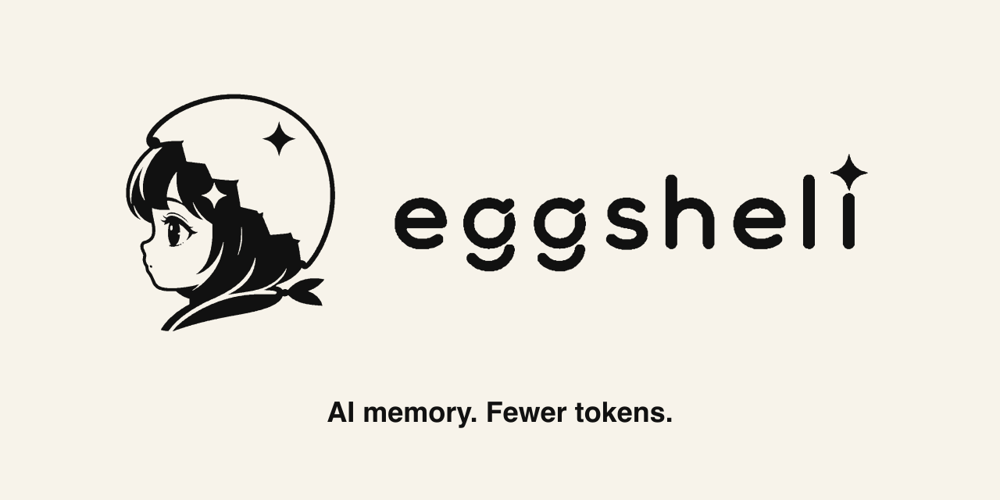

  <picture>
    <source media="(prefers-color-scheme: dark)" srcset="assets/brand/github-social-preview-dark-1280x640.png">
    
  </picture>

# Brand assets

[Project home](../README.md) · [Plugin guide](codex-plugin.md)

Eggshell's visual identity pairs a soft, hand-drawn eggshell character with a crisp monochrome wordmark. Warm ivory is the primary presentation surface: it keeps the character friendly while the black artwork retains technical clarity.

All canonical assets live in [`docs/assets/brand`](assets/brand/). Use the supplied files directly; do not redraw the symbol, substitute the wordmark, or apply per-part colors.

## Asset library

| Asset | Best use |
| --- | --- |
| [Primary stacked](assets/brand/eggshell-primary-stacked.svg) | General-purpose centered lockup on a light surface. |
| [Primary stacked — black](assets/brand/eggshell-primary-stacked-black.svg) | Explicit black artwork for light backgrounds and export pipelines. |
| [Primary stacked — white](assets/brand/eggshell-primary-stacked-white.svg) | Dark backgrounds, presentations, and dark UI. |
| [Primary horizontal](assets/brand/eggshell-primary-horizontal.svg) | Headers, documentation covers, and wide layouts. |
| [Primary horizontal — white](assets/brand/eggshell-primary-horizontal-white.svg) | Horizontal lockup for dark backgrounds and dark UI. |
| [Symbol](assets/brand/eggshell-symbol.svg) | Small square placements where the name appears nearby. |
| [Wordmark](assets/brand/eggshell-wordmark.svg) | Narrow text-only placement when the symbol is already established. |
| [Dark app icon](assets/brand/eggshell-app-icon-dark-1024.png) | App icon source and square avatars. |
| [Light social preview](assets/brand/github-social-preview-light-1280x640.png) | Current repository social preview and light link cards. |
| [Dark social preview](assets/brand/github-social-preview-dark-1280x640.png) | Dark link cards. |
| [Light source](assets/brand/github-social-preview-light-1280x640.svg) / [dark source](assets/brand/github-social-preview-dark-1280x640.svg) | Editable layouts that preserve the canonical logo. |
| [Recorded walkthrough](demo.md) | Animation, static overview, and shareable 30-second MP4 based on the LLVM study. |
| [Cross-chat handoff](assets/brand/cross-chat-handoff.svg) | Illustrative diagram showing what moves between independent chats. |
| [How it works](assets/brand/how-it-works.svg) | Three-step product explanation for documentation and presentations. |

## Primary lockup

  <picture>
    <source media="(prefers-color-scheme: dark)" srcset="assets/brand/eggshell-primary-stacked-white.svg">
    <source media="(prefers-color-scheme: light)" srcset="assets/brand/eggshell-primary-stacked-black.svg">
    
  </picture>

Use the stacked lockup when Eggshell is the main subject and the layout has vertical room. Use the horizontal lockup in compact documentation and product headers.

## Symbol and app icon

  
  &nbsp;&nbsp;&nbsp;&nbsp;
  

The bare symbol is appropriate only where “Eggshell” is clear from the surrounding product or repository. Prefer the dark app icon for square launchers and avatars because it includes its own high-contrast background.

## Usage guidance

- Preserve the original aspect ratio and surrounding breathing room.
- Use black artwork on light surfaces and white artwork on dark surfaces.
- Keep the mascot and wordmark together in their supplied relationship.
- Use the symbol alone only at sizes where its facial features remain legible.
- Add descriptive alt text such as `Eggshell — local memory for AI agents that saves tokens`.
- Do not stretch, rotate, outline, shadow, crop, recolor individual parts, or typeset a replacement wordmark.

## GitHub repository preview

GitHub does not automatically read a social-preview image from the repository. Upload [`github-social-preview-light-1280x640.png`](assets/brand/github-social-preview-light-1280x640.png) in the repository's **Settings → General → Social preview** control.

The preview keeps the canonical horizontal mascot and wordmark together, with
the caption **“AI memory. Fewer tokens.”** below. The README uses the same
headline beneath its existing theme-aware horizontal logo. Installation
documentation identifies the available integrations and their validation status.

Regenerate both the self-contained SVG and PNG with
`python3 scripts/render_social_preview.py` (requires `rsvg-convert`). GitHub
stores one social preview image; the separate dark export is available for
other placements.
