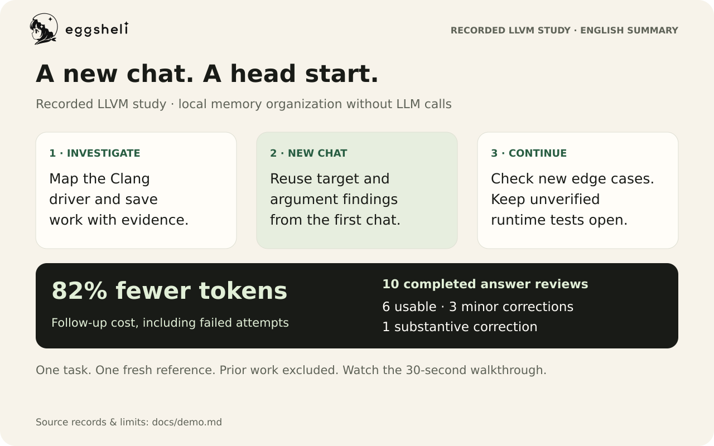
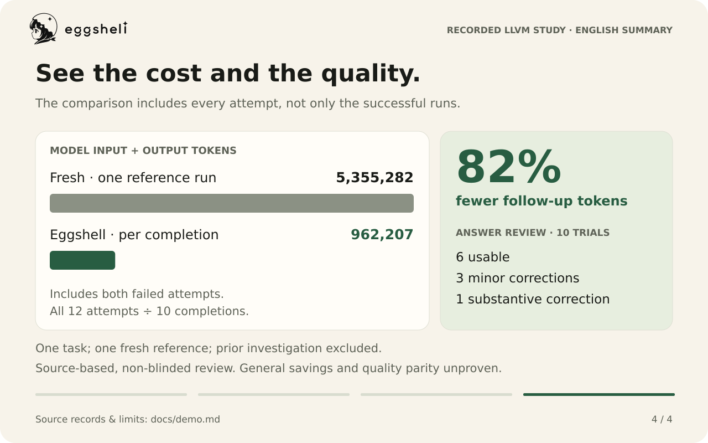

# A new chat. A head start.

[Project home](../README.md) · [Install](../README.md#install) · [Measurement record](benchmarks/llvm-follow-up.json)

One Codex chat investigates how Clang chooses a toolchain. A separate chat uses
those findings to investigate an edge case. The earlier work is available as
evidence, with new checks and unresolved questions kept visible.

**[Watch the 30-second walkthrough](assets/demo/walkthrough.mp4)** ·
[Animated version](assets/demo/walkthrough.gif) ·
[Static overview](assets/demo/overview.svg)



This is an English, edited walkthrough of recorded experimental work, not a
screen recording or a new benchmark. The example follows **the first completed
trial**; the cost and quality comparison includes **all ten completed trials
and both failed attempts**. The original answers were in Japanese.

## 1. Investigate once

The first chat mapped Clang's driver options, target selection, toolchains,
argument translation, and jobs. It retained source locations and relevant tests.

The question, shortened for this walkthrough:

> Investigate Clang driver option parsing and toolchain selection. Map the
> call and data flow, state the invariants, and identify findings the next task
> can reuse.

Its findings included:

- `computeTargetTriple` determines the target used for toolchain selection.
- Host toolchain creation happens before input-argument translation.
- Per-toolchain arguments pass through steps such as `TranslateXarchArgs`.

These facts appear in the fixed LLVM source:
[target calculation](https://github.com/llvm/llvm-project/blob/6dfe1677ab8dffbc6ec13d53a1e0215d75147689/clang/lib/Driver/Driver.cpp#L619-L663),
[host toolchain creation](https://github.com/llvm/llvm-project/blob/6dfe1677ab8dffbc6ec13d53a1e0215d75147689/clang/lib/Driver/Driver.cpp#L1695-L1722),
and [per-toolchain arguments](https://github.com/llvm/llvm-project/blob/6dfe1677ab8dffbc6ec13d53a1e0215d75147689/clang/lib/Driver/Compilation.cpp#L63-L111).

The initial investigation cost **6,552,155 model tokens**. That work already
existed before the follow-up comparison. Building the saved graph from its
recorded hooks made **no additional model calls**; every follow-up attempt used
the same saved graph.

## 2. Open an independent chat

The next question asked about **target and language options that change the
selected toolchain or forwarded arguments**. Both the fresh reference and
Eggshell trials received the same task prompt and fixed source snapshot.

In the illustrated trial, the `UserPromptSubmit` hook delivered selected prior
work, including the first answer and supporting tool evidence. The new answer
explicitly identified these findings as reused. An English translation of that
section is:

> **Reused:** `computeTargetTriple` determines the target triple, which is used
> to select and cache the toolchain. Per-toolchain arguments are constructed
> through steps including `TranslateXarchArgs`.

This is the concrete work carried forward: the target-selection map and
argument-translation findings. The record establishes delivery and reported
reuse; it does not establish an exact number of reads or searches avoided.

Eggshell's memory organization and search run locally. The selected handoff
still consumes normal model input tokens, which are included in the counts below.

## 3. Investigate the remaining question

The same answer separated the new work from the reused findings:

| Part of the answer | What the recorded trial did |
| --- | --- |
| Reused | Target selection, toolchain caching, and per-toolchain argument construction. |
| New checks | Inspected SPIR-V language tests, Darwin argument forwarding, OpenMP forwarding, and clang-cl input handling. |
| New finding | Identified a possible mismatch between how `usesInput` scans language flags/extensions and how `BuildInputs` applies `-x` to inputs. |
| Left open | Runtime output and the proposed correction remained unverified because the snapshot lacked built Clang and FileCheck executables. |
| Final decision | Kept the source unchanged and handed off the candidate for further verification. |

The candidate has static support in
[`usesInput`](https://github.com/llvm/llvm-project/blob/6dfe1677ab8dffbc6ec13d53a1e0215d75147689/clang/lib/Driver/Driver.cpp#L128-L137),
[`BuildInputs`](https://github.com/llvm/llvm-project/blob/6dfe1677ab8dffbc6ec13d53a1e0215d75147689/clang/lib/Driver/Driver.cpp#L3097-L3307),
and [toolchain selection](https://github.com/llvm/llvm-project/blob/6dfe1677ab8dffbc6ec13d53a1e0215d75147689/clang/lib/Driver/Driver.cpp#L7244-L7252).
It is a source-based finding, not a demonstrated runtime failure or an accepted fix.
The source snapshot stayed fixed throughout this study; source-change handling
was not measured here.

This first completed trial used **613,949 tokens** and was reviewed as **usable**.
It illustrates the workflow; the headline below is calculated across all attempts.

## 4. Compare tokens and answer quality



| Measurement | Input + output tokens | Reduction vs. fresh reference |
| --- | ---: | ---: |
| Fresh: one independent run without prior memory | 5,355,282 | — |
| Eggshell: average of ten completed trials | 683,362 | 87.2% |
| Eggshell: all twelve attempts / ten completions | **962,207** | **82.0%** |

The inclusive figure is **9,622,073 tokens / 10 completions**. It includes
**2,788,458 tokens** spent on two failed attempts with missing hook output.
The preceding investigation's 6,552,155 tokens are excluded from these follow-up
figures. Cached input is already included in input, and reasoning is already
included in output; neither is added twice. Token reduction is not a dollar-cost
estimate because different token categories can have different prices.

The source-grounded review found **six usable answers, three requiring minor
corrections, and one requiring a substantive correction**. The substantive
error involved an incorrect predicted toolchain difference for a logical
`spirv` target. It is included in the reported results.

This was **one task**, ten completed Eggshell trials, one fresh reference, and
a single non-blinded reviewer. Runtime Driver tests were unavailable. The
fresh answer investigated additional causes; equal answer quality, a general
savings rate, and superiority over other memory tools are not established.
These historical measurements predate the later hook-lifecycle update and do
not measure its effect on tokens or failures.

## Try the workflow in your project

**[Try the public two-chat sample](try-it.md)** for exact prompts, an offline
Python project, and checks that distinguish saving from actual delivery. Or use
your own project with the steps below.

After [installation](../README.md#install), initialize a project with `egg init`.

1. Ask a Codex chat: **“Find how configuration is loaded and identify the relevant tests.”**
2. Let the investigation finish. Eggshell saves observed work and its result.
3. Open a separate chat in that project: **“Which tests should change if we add a new configuration option?”**
4. Run `!egg graph` to see exactly which prior work was delivered; `!egg why`
   explains the selection.

These are ordinary task questions. No special memory-writing prompt is needed.
If the project changes between chats, prior findings remain historical evidence
and the agent should check the affected facts.

## Inspect the evidence

The [measurement record](benchmarks/llvm-follow-up.json) contains every trial's
input/output totals, answer and receipt hashes, quality outcomes, model, fixed
source commit, and saved-graph hash. The
[walkthrough provenance](benchmarks/llvm-walkthrough.json) identifies the answer
sections and first handoff used here. The English wording is edited or
translated; full private transcripts and local filesystem paths are not
republished. Hashes establish which local records were inspected, but are not
a substitute for access to those records.

The checked-in SVGs contain the reviewed figures from the measurement record.
The Lean renderer checks that record's fingerprint before rendering the GIF
and MP4. If the record changes, review the SVG figures and update the fingerprint.
With `rsvg-convert`, ImageMagick, and FFmpeg installed:

```sh
lake build eggshell_render
.lake/build/bin/eggshell_render demo
```
